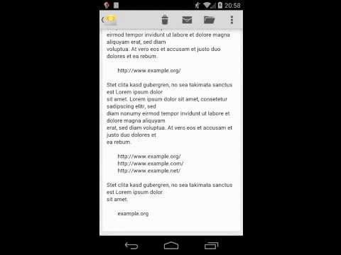

# Easy Open Link
Easy Open Link is a small Android app which makes it easy to open links from text documents via the share function of many apps. No more cumbersome copy and paste. Easy Open Link also allows you to open several links at the same time.

* Roughly select the URL(s). It does not matter if the selection also contains additional text or white spaces.
* Press the "share" symbol.
* Select "open link"

The share function has become a common feature in more recent versions of Android. This app requires Android 2.2 or newer, but is most useful with Android 4.0 or later.

Instruction video:

# Donations
Easy Open Link is free. Easy Open Link will stay free. Always and forever. If you really like Easy Open Link, please consider making a donation.

# Binary
Binary releases (aka APKs) are available on:

# License
This software is licensed under the terms of the [GPL v3](https://gitlab.com/marc.nause/openlink/raw/master/LICENSE).

