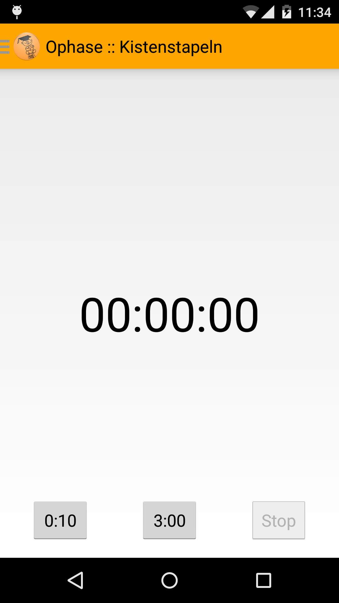
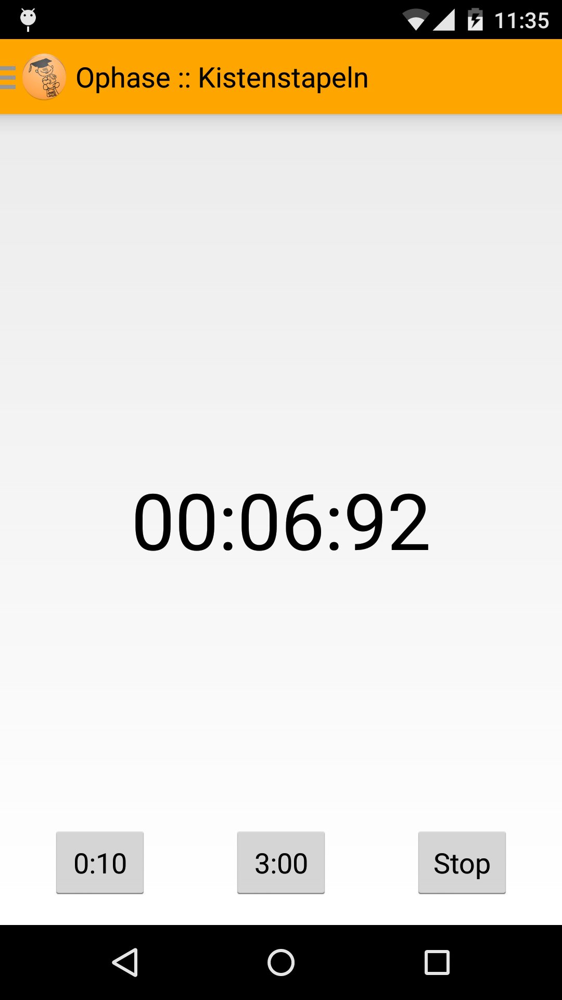
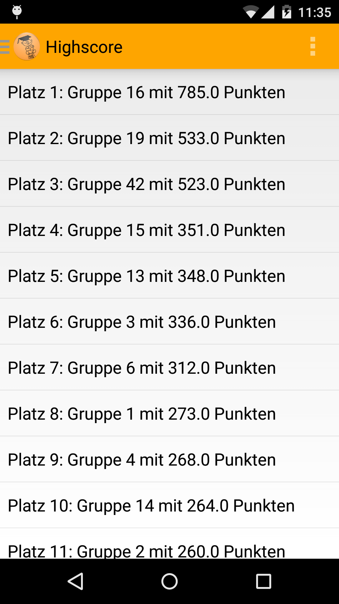
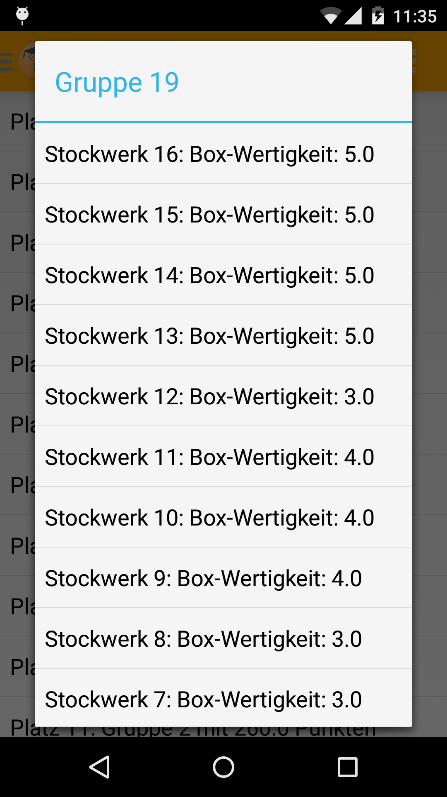
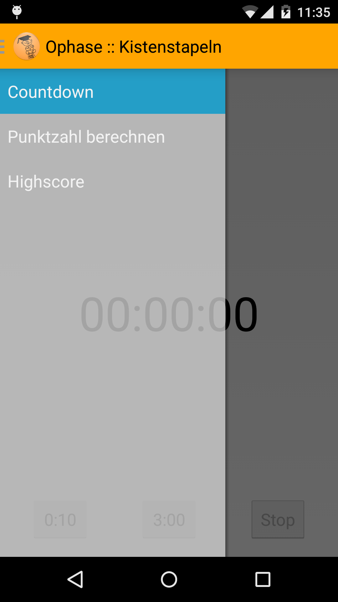

# Kistenstapeln-Android
Android App for the evaluation of a simple box stacking game.

## Screenshots
**The countdown interface**




**The calculation interface**


**The highscore interface**




**The navigationdrawer**



## Licence
```
This file is part of Ophasenkistenstapeln.

Ophasenkistenstapeln is free software: you can redistribute it and/or modify
it under the terms of the GNU General Public License as published by
the Free Software Foundation, either version 3 of the License, or
(at your option) any later version.

Ophasenkistenstapeln is distributed in the hope that it will be useful,
but WITHOUT ANY WARRANTY; without even the implied warranty of
MERCHANTABILITY or FITNESS FOR A PARTICULAR PURPOSE.  See the
GNU General Public License for more details.

You should have received a copy of the GNU General Public License
along with Ophasenkistenstapeln.  If not, see <http://www.gnu.org/licenses/>.
```
