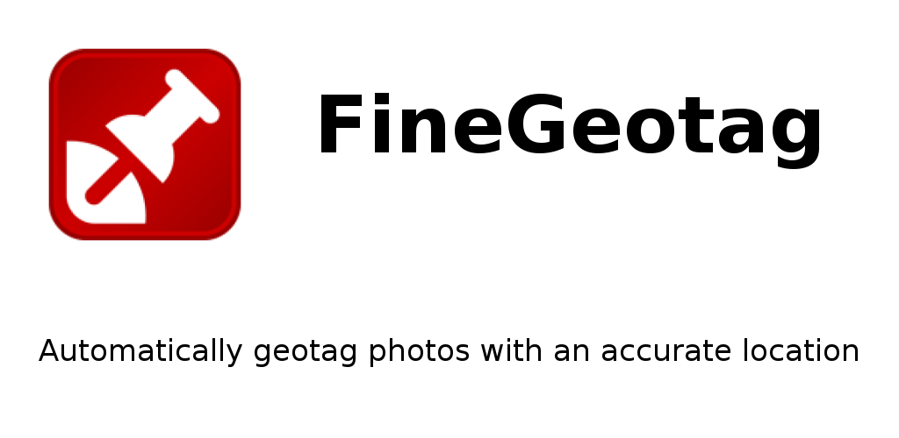
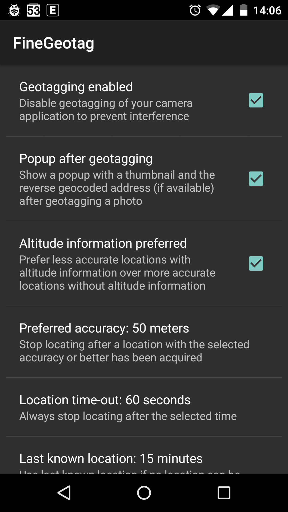

# FineGeotag

Automatically geotag photos with a real-time location right after they are taken.

The camera application mostly uses the last known location, which could be old and miles away from your current position.

FineGeotag will try to acquire an accurate location in real-time
and update the [Exif](http://en.wikipedia.org/wiki/Exchangeable_image_file_format) location tags of the photos taken.

FineGeotag will try to use the GPS and/or the network location, depending on which location providers are enabled in the Android settings.

Optionally a popup will be shown with a thumbnail of the photo and the [reverse geocoded](http://en.wikipedia.org/wiki/Reverse_geocoding) address.

Don't forget to disable geotagging of your camera application to prevent interference.

You could use [PhotoMap](https://play.google.com/store/apps/details?id=eu.bischofs.photomap) or similar to display geotagged photos on a map.

Works only for JPEG pictures.

Works on Android 4.0 (Ice Cream Sandwich) and later.

You can ask questions [here](http://forum.xda-developers.com/android/apps-games/20150508-fine-geotag-t3103110).

# Permissions

*ACCESS_COARSE/FINE_LOCATION*: to acquire locations for geotagging

*READ/WRITE_EXTERNAL_STORAGE*: to write [Exif](http://en.wikipedia.org/wiki/Exchangeable_image_file_format) location tags to photos

# Privacy

FineGeotag has no INTERNET permission, so you don't have to be afraid privacy sensitive information is going anywhere.

# Download

* [Play store](https://play.google.com/store/apps/details?id=eu.faircode.finegeotag)
* [GitHub releases](https://github.com/M66B/FineGeotag/releases)

# Support

You can [create a GitHub issue](https://github.com/M66B/FineGeotag/issues) for bugs and feature requests
or use [this XDA forum](http://forum.xda-developers.com/android/apps-games/20150508-fine-geotag-t3103110) for questions and remarks.

# Attribution

The application icon is taken from the [Geotag Icon Project](https://geotagicons.wordpress.com/).

[Gson](https://github.com/google/gson) is being used to serialize/deserialize locations.

# License

[GNU General Public License version 3](http://www.gnu.org/licenses/gpl.txt)

Copyright (c) 2015 [Marcel Bokhorst](http://blog.bokhorst.biz/about/)
([M66B](http://forum.xda-developers.com/member.php?u=2799345))
All rights reserved

This file is part of FineGeotag.

FineGeotag is free software: you can redistribute it and/or modify
it under the terms of the GNU General Public License as published by
the Free Software Foundation, either version 3 of the License, or
(at your discretion) any later version.

FineGeotag is distributed in the hope that it will be useful,
but WITHOUT ANY WARRANTY; without even the implied warranty of
MERCHANTABILITY or FITNESS FOR A PARTICULAR PURPOSE.  See the
GNU General Public License for more details.

You should have received a copy of the GNU General Public License
along with FineGeotag.  If not, see [http://www.gnu.org/licenses/](http://www.gnu.org/licenses/).

