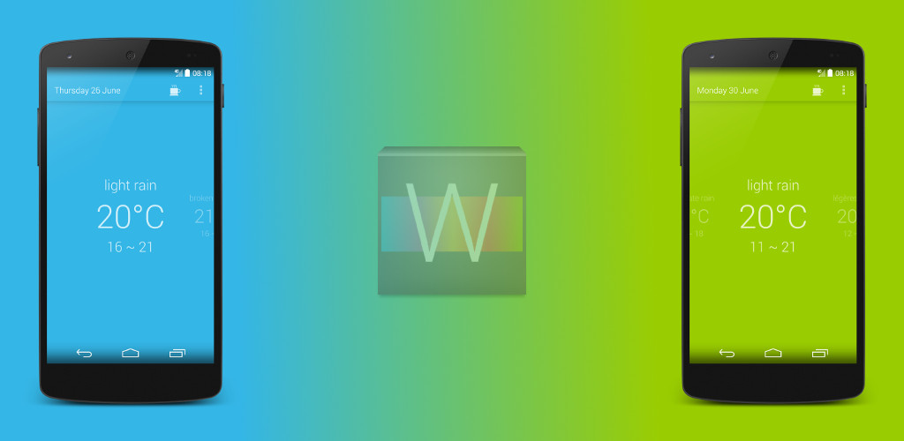

SimpleWeatherForecast
=====================

[Download from Google Play Store](https://play.google.com/store/apps/details?id=fr.tvbarthel.apps.simpleweatherforcast)

###Description
Simple Weather Forecast gives you a 14-day forecast based on your current location. This application is extremely light, fast, free and without any ads.
It doesn't collect any personal information.

###Permissions
 * Approximate location: Simple Weather Forecast uses your approximate location to give you a relevant forecast.
 * Network access and connections: Simple Weather Forecast uses the network only to get the forecast from openweathermap, and that's it.
 * Google Play billing service : This is only to offer the possibility of making donations to support our open-source developments. 

###Disclaimer
Developed by two students, this application is distributed "as is", without any pretention.

###Special thanks...
...to the [XDA Android App Testers G+ community](https://plus.google.com/communities/100406373096097711894) for its help during the beta.

License
=====================
Copyright (C) 2014 tvbarthel

Licensed under the Apache License, Version 2.0 (the "License");
you may not use this file except in compliance with the License.
You may obtain a copy of the License at

    http://www.apache.org/licenses/LICENSE-2.0

Unless required by applicable law or agreed to in writing, software
distributed under the License is distributed on an "AS IS" BASIS,
WITHOUT WARRANTIES OR CONDITIONS OF ANY KIND, either express or implied.
See the License for the specific language governing permissions and
limitations under the License.
