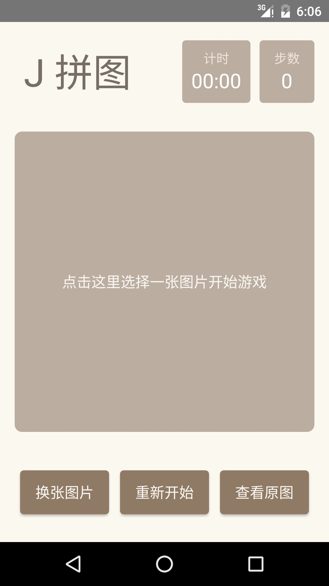
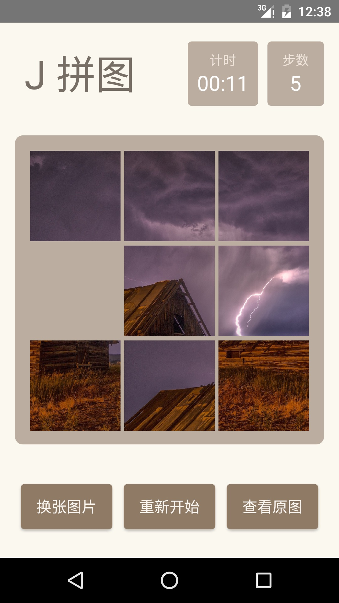
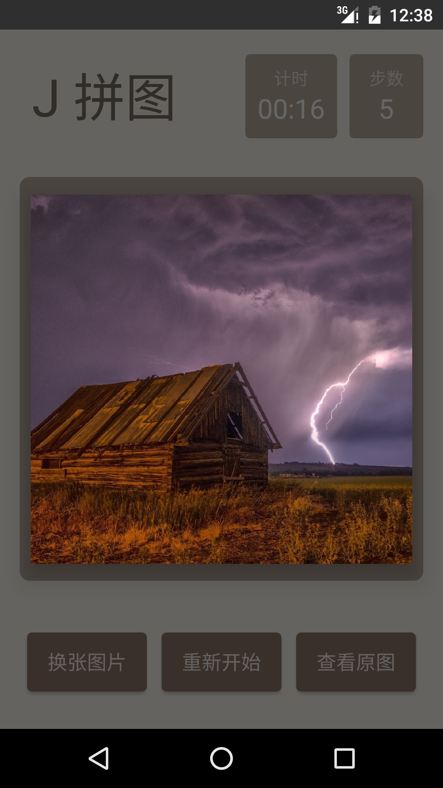

# Jigsaw (J 拼图) for Android

这是一个简易的拼图游戏，玩家可以选择内置的或自己相册中的图片开始游戏，游戏将记录玩家完成所花时间以及移动的步数。

Google Play：https://play.google.com/store/apps/details?id=im.r_c.android.jigsaw

fir.im (可直接下载)：http://fir.im/jigsaw

## Screenshots

